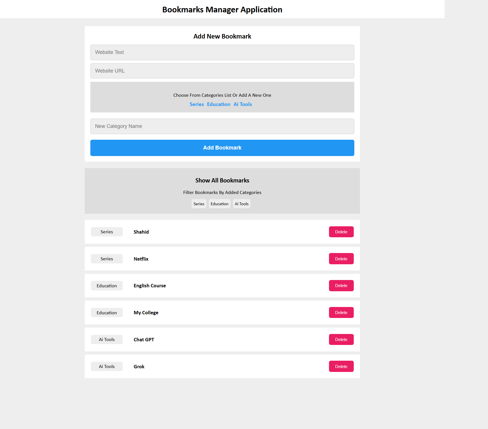
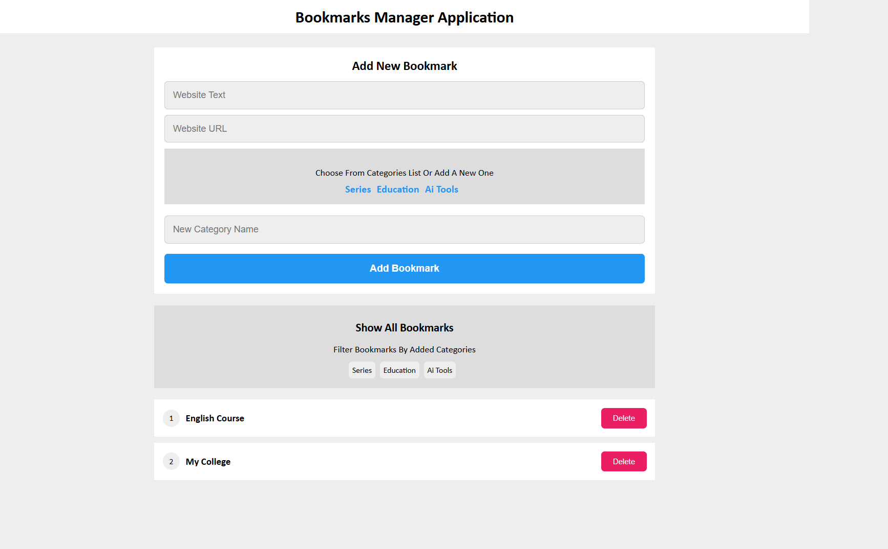

# 🔖 Bookmarks Manager

> A fast, responsive, and organized way to manage your web bookmarks locally in your browser.

## 📖 Project Overview

The **Bookmarks Manager** is a frontend practice project built using Vanilla JavaScript. It provides a clean, user-friendly interface to store, categorize, and filter your favorite websites. The project demonstrates strong fundamentals in algorithms, DOM manipulation, event handling, and utilizing the browser's `localStorage` for robust data persistence without the need for a backend database.

## ✨ Features

- **Add Bookmarks:** Quickly save any website with a custom title, URL, and category.
- **Categorization:** Organize links logically into separate categories for easier access.
- **Smart Suggestions:** The app suggests previously used categories as you type to prevent duplication.
- **Dynamic Filtering:** Click on any category tag to instantly filter and display only the related bookmarks.
- **Data Persistence:** All entries are securely stored in the browser's Local Storage; data survives page reloads.
- **Quick Deletion:** Remove outdated or unwanted bookmarks with a single click.
- **Validation:** Built-in checks to prevent adding duplicate URLs or empty fields.

## 📸 Screenshots & Demo

🔗 **Live Demo:** 👉 https://bookmarks-managerr.netlify.app

### Main Interface


### Filter by Category


## 🛠 Tech Stack & Tools

- **HTML5:** Semantic structure and form elements.
- **CSS3:** Custom styling, Flexbox layouts, and responsive design.
- **JavaScript (Vanilla/ES6):** Core application logic, DOM Manipulation, and Web Storage API.

## ⚙️ Architecture & System Design

This is a client-side only application leveraging a localized data flow format:
1. **User Input:** The front-end captures data from the HTML form.
2. **Validation Layer:** JavaScript processes the inputs to ensure they are not empty and URLs/Titles don't already exist.
3. **State Management:** The categorized data is serialized into a JSON object and securely stored in `localStorage` under the `bookmark` key.
4. **UI Render:** The DOM is dynamically cleared and re-rendered based on the updated state fetched from `localStorage`.

## 🚀 Installation & Setup

There is no complex setup required (no `npm install` needed) since this is a pure Vanilla JS project.

1. Clone the repository:
   ```bash
   git clone https://github.com/yassenahmed77/bookmarks-manager.git
   ```
2. Navigate to the project directory:
   ```bash
   cd bookmarks-manager
   ```

## 💻 How to Run Locally

1. Simply double-click and open the `index.html` file in any modern web browser.
2. Alternatively, use a local server like **Live Server** extension in VS Code for hot-reloading:
   - Right-click `index.html` -> "Open with Live Server".

## 📘 Usage Guide

1. Enter a descriptive **Website Text** and the **Website URL** in the form.
2. Type a new **Category Name** or select an existing one from the suggested list.
3. Click the **Add Bookmark** button.
4. In the "Show All Bookmarks" section, click on any category tag to dynamically filter your saved bookmarks.
5. Click **Delete** next to any bookmark to immediately remove it from your Local Storage.

## 📁 Folder Structure

```
📁 Bookmarks Manager/
├── 📄 index.html      # Main HTML layout and entry point
├── 📄 master.css      # Stylesheet for the UI
├── 📄 main.js         # Core JavaScript logic
└── 📄 README.md       # Project documentation
```

## 🤝 Contribution Guidelines

This is an individual practice project. However, feedback and suggestions are highly welcome! Feel free to fork the repository, make improvements, and submit a Pull Request.

## 📞 Author

**Yassen Ahmed**
- GitHub: [@yassenahmed77](https://github.com/yassenahmed77)
